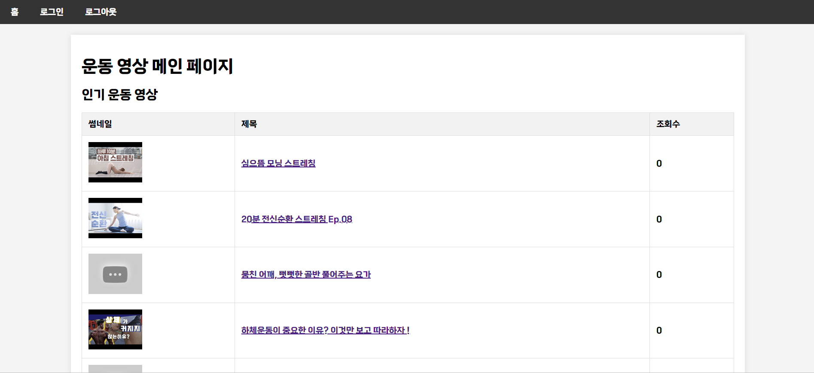

# SSAFIT Project
----------
## 1. 목표
- Java의 Back-End 기술인 Servlet/JSP를 이해하고 이를 활용하여 웹 서버를 구축할
수 있다.
- MVC 구조를 이해하고 이를 활용하여 프로그램을 작성할 수 있다.
- Front-End 관통 프로젝트를 참고하여 화면과 연계가 필요한 부분의 Back-End를
완성한다.

## 2. 팀원 및 역할 분담
- **최보성**: 리뷰 관련 MVC 구조 작성
- **이윤준**: 메인 화면과 리뷰 화면 합치기, 스타일 태그 작성
- **김성현**: 메인 화면 관련 MVC 구조 작성

## 3. 기능 구현 화면
- 메인페이지

- 리뷰 등록

- 리뷰 목록

- 리뷰 수정

- 리뷰 삭제

## 4. 느낀 점
- 프론트엔드 관련 PJT를 진행할 때 역할분담이 원활하지 못하여 같은 작업을 여러명이 수행한 경험이 있어 작업을 시작하기 전 확실하게 역할을 분담하여 같은 일을 여러번하는 일이 없도록 하였다.
- 팀원마다 다른 MVC구조를 작성하며 마지막에 하나로 합칠 때 conflict가 생길 것을 고려하며 변수명, class명 등을 작성하여 합칠 때 큰 어려움 없이 합칠 수 있었다.
- 프롬프트 작성을 잘하는 팀원은 생성형 AI를 활용하여 MVC 구조를 작성하고 디자인에 실력이 있는 팀원은 스타일 태그를 작성하는 등 각자의 장점을 살려 시간 내에 프로젝트를 성공적으로 마무리 할 수 있었다.
- 수업과 실습으로 배운 백엔드를 활용하여 직접 MVC 구조를 만들어보며 배운 내용을 충분히 숙지한다면 실무에서도 어느정도 활용할 수 있을 것이라는 생각을 하게 되었다.
- 프론트엔드에서 HTML과 JS로 구현했던 내용들을 백엔드에서 JSP와 Servlet을 통해 구현하며 같은 기능을 구현하더라도 여러 방식으로 구현할 수 있다는 것을 알게 되었다.